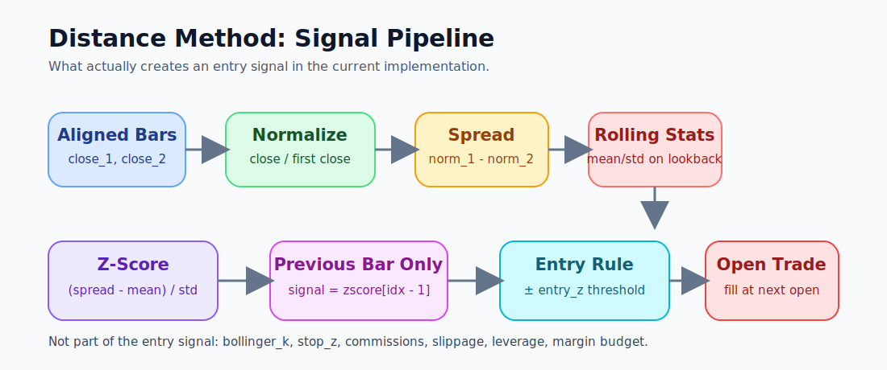
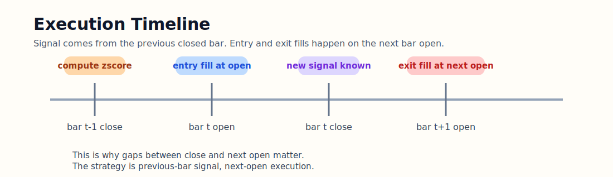
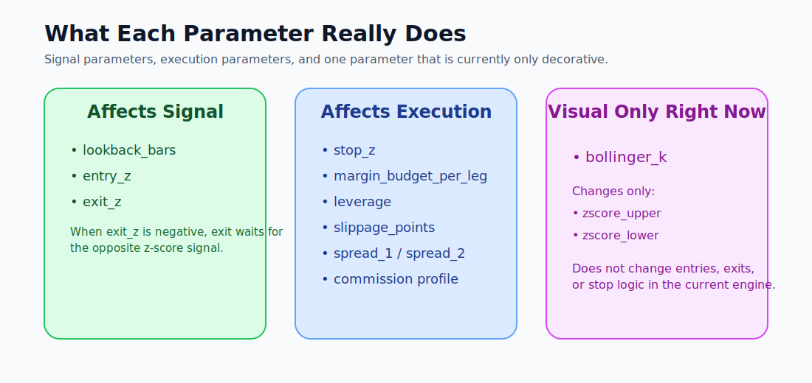
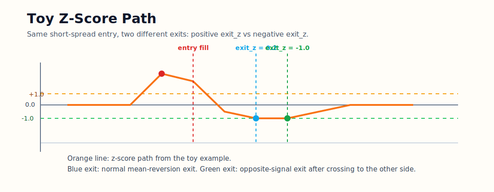

# Distance Method Audit

Code-based revision of the current `distance` trading method as implemented in:

- `src/domain/backtest/distance_engine.py`
- `src/domain/backtest/distance_pricing.py`
- `src/domain/optimizer/distance.py`
- `src/domain/wfa_genetic.py`
- `src/domain/wfa_serialization.py`

This document describes what the strategy actually does now, not what a classical pairs-trading paper would usually mean by “distance method”.

## 1. One-Screen Summary

The current strategy is:

1. take two aligned close series
2. rebase both to their first close in the test window
3. build `spread = normalized_1 - normalized_2`
4. compute rolling mean/std of that spread on `lookback_bars`
5. compute `zscore`
6. enter on the previous bar z-score crossing `entry_z`
7. execute on the next bar open with spread and slippage costs
8. size each leg independently from `margin_budget_per_leg * leverage`
9. exit by:
   - `exit_z >= 0`: normal mean-reversion exit
   - `exit_z < 0`: opposite-signal exit
   - `stop_z`
   - end of test window

Important consequence:

- this is **not** a hedge-ratio spread
- this is **not** a Johansen spread
- this is **not** a regression residual
- `bollinger_k` is still **visual only** and does not change trading decisions

## 2. Visual Map

### 2.1 Signal Pipeline



### 2.2 Execution Timing



### 2.3 Parameter Map



### 2.4 Toy Signal Example



## 3. Exact Sequential Description Of The Entry Signal

This is the exact order used by the code in `src/domain/backtest/distance_engine.py`.

### Step 1. Load two synchronized bar series

The engine works on one joined frame with columns like:

- `time`
- `open_1`, `close_1`, `spread_1`
- `open_2`, `close_2`, `spread_2`

If bars do not line up by time, they are removed by the inner join.

### Step 2. Normalize both close series to the first bar of the whole test window

The code does:

```text
normalized_1[t] = close_1[t] / close_1[0]
normalized_2[t] = close_2[t] / close_2[0]
```

So if:

- `close_1[0] = 100`
- `close_2[0] = 200`

and later:

- `close_1[t] = 110`
- `close_2[t] = 206`

then:

```text
normalized_1[t] = 1.10
normalized_2[t] = 1.03
```

### Step 3. Build the spread

The strategy spread is:

```text
spread[t] = normalized_1[t] - normalized_2[t]
```

Using the numbers above:

```text
spread[t] = 1.10 - 1.03 = 0.07
```

This means the engine assumes an implicit hedge ratio of `1` after rebasing.  
There is no regression beta and no cointegration vector here.

### Step 4. Compute rolling spread mean and std on `lookback_bars`

For each bar:

```text
spread_mean[t] = mean(spread window)
spread_std[t]  = std(spread window)
```

If `spread_std[t] <= 0`, then signal is invalid on that bar.

### Step 5. Compute z-score

The core signal is:

```text
zscore[t] = (spread[t] - spread_mean[t]) / spread_std[t]
```

This `zscore` is the actual trading signal.

### Step 6. Use the previous bar z-score, not the current bar

The engine decides on bar `idx` using:

```text
signal = zscore[idx - 1]
```

This is very important:

- signal is read from the **previous closed bar**
- execution happens on the **current bar open**

So the logic is not “see close and trade at that same close”.  
It is “see previous close, fill at next open”.

### Step 7. Convert the signal into an entry

If there is no active position:

- if `signal >= entry_z` -> open `short_spread`
  - `leg_1 = short`
  - `leg_2 = long`
- if `signal <= -entry_z` -> open `long_spread`
  - `leg_1 = long`
  - `leg_2 = short`
- otherwise -> no trade

### What influences the entry signal

These inputs affect whether the engine opens a position:

- `close_1`
- `close_2`
- first bar of the whole test window: `close_1[0]`, `close_2[0]`
- `lookback_bars`
- `entry_z`
- enough history for rolling mean/std
- non-zero rolling spread std

### What does **not** influence the entry signal

These do not change whether an entry is triggered:

- `bollinger_k`
- `exit_z`
- `stop_z`
- `spread_1`, `spread_2`
- `slippage_points`
- commissions
- leverage
- `margin_budget_per_leg`
- optimizer objective

## 4. Exact Exit Logic

### 4.1 Mean-Reversion Exit

If `exit_z >= 0`:

- short spread exits when `signal <= exit_z`
- long spread exits when `signal >= -exit_z`

Example:

- `entry_z = 2.0`
- `exit_z = 0.5`

Then:

- a short spread entered near `+2` closes when z-score falls back to `+0.5` or lower
- a long spread entered near `-2` closes when z-score rises back to `-0.5` or higher

### 4.2 Opposite-Signal Exit

If `exit_z < 0`, the strategy now treats it as an opposite-signal exit:

- short spread exits when `signal <= exit_z`
- long spread exits when `signal >= -exit_z`

Example:

- `entry_z = 2.0`
- `exit_z = -1.0`

Then:

- a short spread does **not** exit near zero
- it exits only after z-score pushes through to `-1.0`
- a long spread exits only after z-score pushes through to `+1.0`

In the full trade table this is stored as:

- `exit_reason = "opposite_signal"`

### 4.3 Stop Exit

If `stop_z` is enabled:

```text
abs(signal) >= stop_z
```

then the trade closes with:

- `exit_reason = "stop_z"`

### 4.4 End-Of-Period Exit

If the last bar of the test window is reached, the position is forcibly closed with:

- `exit_reason = "end_of_period"`

## 5. Simple 12-Bar Example

This is a toy example from the current code path:

- `close_2` is fixed at `100`
- `lookback_bars = 3`
- `entry_z = 1.0`

`close_1`:

```text
100, 100, 100, 110, 112, 108, 102, 100, 99, 100, 100, 100
```

Then the engine builds:

| idx | close_1 | spread | spread_mean | zscore |
| --- | ---: | ---: | ---: | ---: |
| 0 | 100 | 0.00000 | - | - |
| 1 | 100 | 0.00000 | - | - |
| 2 | 100 | 0.00000 | 0.00000 | - |
| 3 | 110 | 0.10000 | 0.03333 | 1.41421 |
| 4 | 112 | 0.12000 | 0.07333 | 0.88900 |
| 5 | 108 | 0.08000 | 0.10000 | -1.22474 |
| 6 | 102 | 0.02000 | 0.07333 | -1.29777 |
| 7 | 100 | 0.00000 | 0.03333 | -0.98058 |
| 8 | 99 | -0.01000 | 0.00333 | -1.06904 |
| 9 | 100 | 0.00000 | -0.00333 | 0.70711 |
| 10 | 100 | 0.00000 | -0.00333 | 0.70711 |
| 11 | 100 | 0.00000 | 0.00000 | 0.00000 |

### What happens

1. At `idx = 4` the engine looks at `zscore[3] = 1.41421`
2. `1.41421 >= entry_z(1.0)` -> open `short_spread`
3. Entry happens on `open[4]`, not on the bar-3 close
4. If `exit_z = 0.2`, the short exits when previous-bar z-score gets back to `<= 0.2`
5. If `exit_z = -1.0`, the short stays open longer and exits only after the z-score crosses to the opposite side at `<= -1.0`

## 6. Trade Execution And Costs

## 6.1 Fill price

The engine starts from the current open:

```text
reference_price = open[idx]
```

Then it applies:

1. spread cost
2. slippage cost

using `price_with_costs()` from `src/domain/backtest/distance_pricing.py`.

Important detail:

- spread cost is only added on `buy` side of a leg
- slippage is always adverse

## 6.2 Position sizing

Each leg is sized independently:

```text
exposure_per_leg = margin_budget_per_leg * leverage
raw_lots = exposure_per_leg / margin_basis_per_lot(reference_price)
lots = normalize_volume(raw_lots)
```

This means:

- sizing is not based on spread volatility
- sizing is not based on hedge ratio
- sizing is not based on pair beta
- the two legs can end up with different lot sizes

## 6.3 PnL stack

The engine keeps these layers:

1. gross PnL from raw open-to-open move
2. after spread cost
3. after slippage
4. after commissions

The trade table stores all of them:

- `gross_pnl`
- `spread_cost_total`
- `slippage_cost_total`
- `commission_total`
- `net_pnl`

## 7. Parameter Dictionary

### Parameters that really affect signal generation

- `lookback_bars`
  - affects rolling spread mean/std
  - affects z-score itself

- `entry_z`
  - affects entry threshold

- `exit_z`
  - affects exit threshold
  - `exit_z >= 0`: mean-reversion exit
  - `exit_z < 0`: opposite-signal exit

### Parameters that affect only trade lifecycle / risk

- `stop_z`
  - statistical stop on z-score divergence

- `margin_budget_per_leg`
  - sizing

- `leverage`
  - sizing

- `slippage_points`
  - fill quality

- commissions from instrument spec
  - fill cost

### Parameters that affect only chart decoration right now

- `bollinger_k`
  - only changes `zscore_upper` and `zscore_lower`
  - does **not** change entries
  - does **not** change exits
  - does **not** change stop logic

## 8. Optimizer, WFA And Meta Selector Propagation

The same strategy params are carried through the whole research chain:

- optimizer rows contain
  - `lookback_bars`
  - `entry_z`
  - `exit_z`
  - `stop_z`
  - `bollinger_k`

- WFA folds persist the same fields

- meta selector learns from the WFA history rows built from those same fields

This means:

- if a parameter is logically broken in the backtest core, optimizer and WFA inherit the same problem
- the stack is only as honest as `distance_engine.py`

## 9. Confirmed Findings

### Finding 1. The implemented spread is a rebased price difference, not a hedge-ratio spread

Current code:

```text
normalized_1 = close_1 / close_1[0]
normalized_2 = close_2 / close_2[0]
spread = normalized_1 - normalized_2
```

Implication:

- relative path from the first bar strongly affects signal
- no beta estimation
- no residualization

### Finding 2. Signal is previous-bar based, execution is next-open based

Implication:

- this avoids same-bar close cheating
- but gaps between close and next open directly affect fills

### Finding 3. `bollinger_k` is still non-execution

This is confirmed both in code and tests:

- `src/domain/backtest/distance_engine.py` only uses it for plotted bands
- `tests/test_distance_optimizer.py` explicitly verifies that optimizer evaluations differing only by `bollinger_k` are deduplicated

Implication:

- optimizer/WFA/meta can still carry a parameter that currently changes chart cosmetics only

### Finding 4. Position sizing is margin-budget based per leg

Implication:

- huge moves in one leg can dominate pair behavior
- equity curves can become extreme even when the statistical signal itself is small

### Finding 5. Full summary and fast metrics currently use different drawdown sign conventions

Observed in code:

- full backtest summary stores drawdown as a negative minimum
- metrics fast path stores drawdown as a positive absolute value

Implication:

- WFA/meta/UI comparisons can become semantically inconsistent unless that is normalized

## 10. What Changed In This Revision

This revision adds explicit support for:

- `exit_z < 0` = exit on opposite z-score signal

That support now exists in:

- tester
- optimizer input ranges
- distance backtest trade reasons
- WFA parameter propagation

The trade table now labels this exit path as:

- `opposite_signal`

## 11. Bottom Line

The current `distance` method is best described as:

> a rebased-price, rolling-zscore spread strategy with next-open execution and per-leg margin sizing

It is not wrong because it is simple.  
It is wrong only when the UI or optimizer pretend it is something more sophisticated than what the code really does.

